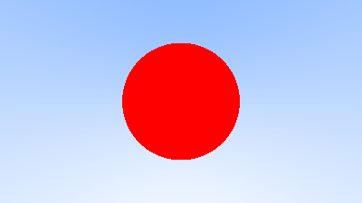

# Ray Tracing

My implementation of Peter Shirley's [Ray Tracing In One Weekend](https://raytracing.github.io/) book/tutorial.  
Its not 100% done, however.  

## Rendered Ray Traced Images
Here are some ray traced images I've rendered so far. 

  
Diffuse spheres.

  
Multi-sampled (randomly) pixels, with normals colored.

  
Simple ray-sphere intersection.

  
No multi-sampling, thus jagged edges should be visible.
